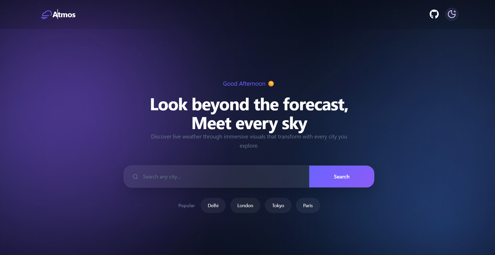

# 🌤️ Atmos

A modern and responsive weather dashboard built with **React**, **TypeScript**, and **Vite**. Atmos provides real-time weather information with beautiful dynamic backgrounds, smooth UI animations, and a clean glassmorphism design.

---

## 📸 Preview



> *(Replace `Preview.png` with your final project screenshot.)*

---

## ✨ Features

- 🌍 Search weather by city
- 🌡️ Current temperature and weather conditions
- 📅 5-Day weather forecast
- 💨 Weather highlights including:
  - Feels Like
  - Humidity
  - Wind Speed
- 🌅 Dynamic weather backgrounds
- 🌙 Manual Day / Night mode
- ✨ Glassmorphism UI
- 📱 Fully responsive design
- ⚡ Fast performance with Vite
- 🧩 Built with reusable React components
- 🔄 Live weather data powered by Open-Meteo APIs

---

## 🛠️ Tech Stack

- React
- TypeScript
- Vite
- CSS3
- Open-Meteo API
- React Icons

---

## 📂 Project Structure

```
src
│
├── assets
│
├── components
│   ├── Navbar
│   ├── Hero
│   ├── WeatherCard
│   ├── Highlights
│   ├── Forecast
│   └── Footer
│
├── services
│   └── weatherApi.ts
│
├── styles
│
├── types
│
├── App.tsx
└── main.tsx
```

---

## 🚀 Getting Started

Clone the repository

```bash
git clone https://github.com/Bhavish193/Atmos
```

Go to the project directory

```bash
cd Atmos
```

Install dependencies

```bash
npm install
```

Start the development server

```bash
npm run dev
```

Build for production

```bash
npm run build
```

---

## 🌐 Live Demo

🔗 **Coming Soon**

*(Replace this with your Vercel deployment URL.)*

---

## 📸 Screenshots

### Home


### Weather Search


*(Replace with your own screenshots if available.)*

---

## 📌 Future Improvements

- 📍 Current location weather
- ⏰ Hourly forecast
- 🌎 Recent search history
- 🌅 Sunrise & Sunset information
- 🌬️ Air Quality Index
- ⭐ Favorite cities

---

## 🙌 Acknowledgements

- Open-Meteo API
- React
- Vite
- React Icons

---

## 📄 License

This project is licensed under the MIT License.